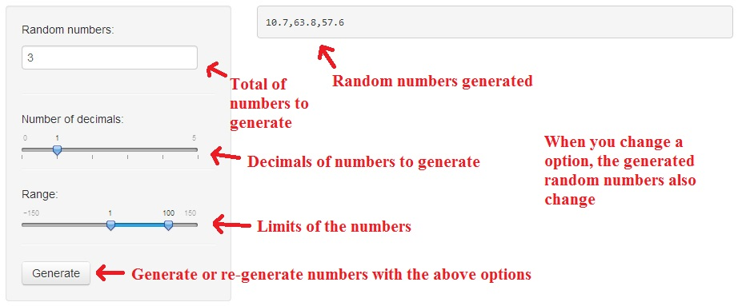

--- 
title       : Random Number Generator
subtitle    : Simple tutorial
author      : Jesus Moran Barbon
job         : Data science course
framework   : io2012        # {io2012, html5slides, shower, dzslides, ...}
highlighter : prettify  # {highlight.js, prettify, highlight}
hitheme     : tomorrow      # 
widgets     : [quiz, bootstrap]            # {mathjax, quiz, bootstrap}
mode        : selfcontained # {standalone, draft}
knit        : slidify::knit2slides

--- bg:#F5DA81

## Goal

<h1><strong>Generate random numbers based on the user options</strong></h1>

For example `r round(runif(14, min = 1, max = 100), digits = 0)`

--- .class #id bg:#A9E2F3

## Options

1. Random numbers
2. Number of decimals
3. Range

For run the app:
<a href="https://jesusmoranbarbon.shinyapps.io/RandomNumberGenerator/">Link to shinyapps io</a>

Code for app:
<a href="https://github.com/jesusmoranbarbon/Shiny-Random-Number-Generator/tree/master/App">Github</a>

--- .bigger bg:#FAFAFA

## Screenshot
</img>

--- &radio bg:#F1F8E0

## Quiz

What happen when you generate the random numbers and then you change the options?

1. Nothing
2. _The random number are re-generated_

*** .hint
Wrong!! The random number are re-generated. For example: `r round(runif(6, min = 1, max = 100), digits = 0)`

*** .explanation
Good!! When you change the options the random numbers are automatically re-generated with the new choices. For example: `r round(runif(6, min = 1, max = 100), digits = 0)`
